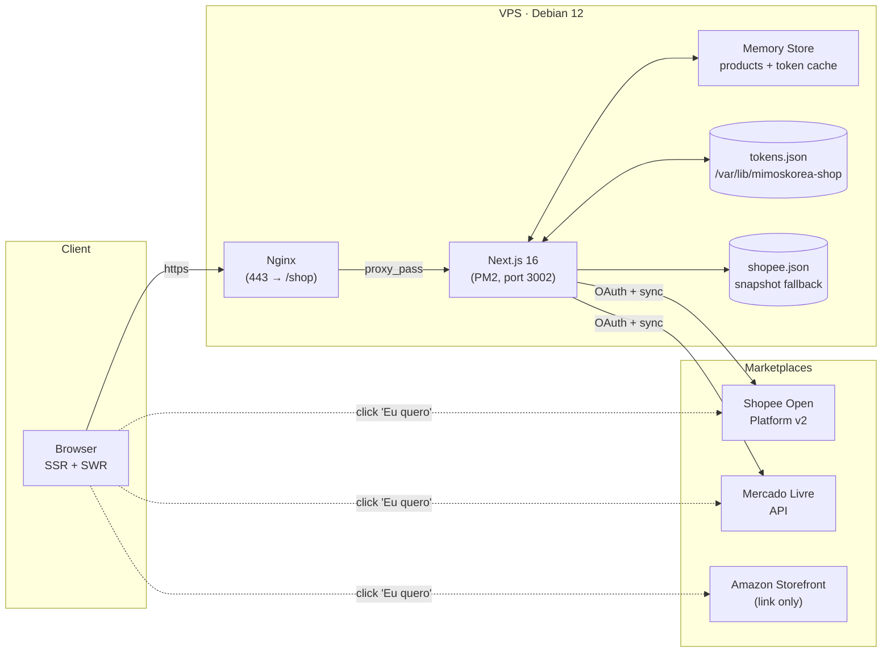
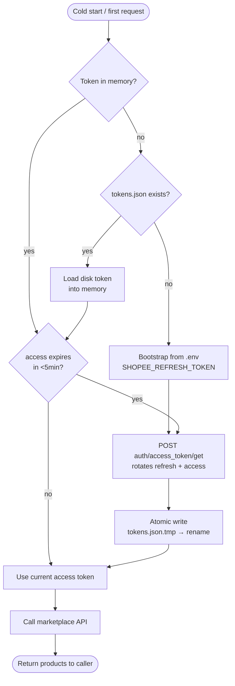
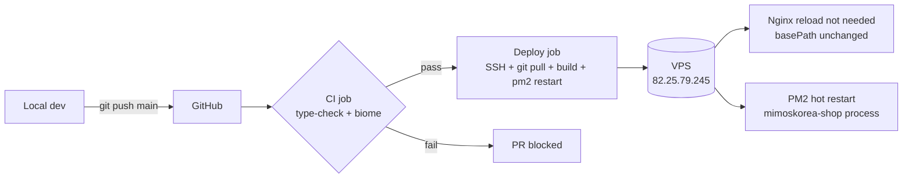

# Mimos Korea Shop


[](https://www.star-history.com/#davccavalcante/mimoskorea-shop&type=timeline&legend=top-left)

Official unified catalog of **Mimos Korea Design** products sold on **Shopee**, **Amazon Brasil**, and **Mercado Livre**. Read-only storefront: each product links directly to the marketplace of origin — no checkout, no cart, no customer data on this site.

⭐ If this project helped you, please star the repository at [github.com/davccavalcante/mimoskorea-shop](https://github.com/davccavalcante/mimoskorea-shop).

## Tech Stack

- **Next.js 16** (App Router, Turbopack, React Server Components)
- **TypeScript** in strict mode
- **Tailwind CSS v4** with semantic design tokens
- **Figtree** (Google Fonts)
- **Biome** (linting + formatting)
- **Framer Motion** (subtle animations, respects `prefers-reduced-motion`)
- **SWR** (client-side infinite scroll)
- **No database** — OAuth tokens persisted to a file on disk

## Architecture



**Key principles:**

- **Read-only catalog.** The app never writes to marketplaces; it only reads product listings.
- **No external database.** Source of truth for tokens is a single JSON file on disk; product data lives in process memory, rehydrated on cold start from a committed snapshot + live sync.
- **Snapshot as safety net.** [`lib/snapshots/shopee.json`](lib/snapshots/shopee.json) is committed and seeds memory before any API call, so the catalog stays populated even if Shopee is down or tokens are revoked.
- **One outbound link per card.** Each product CTA opens the marketplace of origin in a new tab; we never proxy or replay the marketplace listing.

## Project Structure

```
mimoskorea-shop/
├── app/                              Next.js App Router
│   ├── api/
│   │   ├── products/route.ts         Public paginated catalog API
│   │   ├── cron/{sync-shopee,sync-meli}/route.ts
│   │   ├── shopee/oauth/{start,callback}/route.ts
│   │   └── mercadolivre/oauth/{start,callback}/route.ts
│   ├── icon.tsx                      32x32 favicon (next/og)
│   ├── apple-icon.tsx                180x180 (next/og)
│   ├── opengraph-image.tsx           1200x630 social preview
│   ├── robots.ts · sitemap.ts · llms.txt/route.ts
│   ├── globals.css                   Tailwind v4 tokens
│   ├── layout.tsx · page.tsx
├── components/
│   ├── motion-provider.tsx           prefers-reduced-motion gate
│   ├── product-card.tsx · product-card-skeleton.tsx
│   ├── product-grid.tsx              SWR infinite scroll
│   ├── platform-badge.tsx            Shopee/ML/Amazon pill
│   ├── price.tsx                     R$ split-cents layout
│   ├── promo-strip.tsx               top retail-style strip
│   └── site-footer.tsx
├── lib/
│   ├── brand.ts                      brand colors mirror (for next/og)
│   ├── env.ts                        typed env loaders
│   ├── products.ts                   Product / Marketplace types
│   ├── cache/memory.ts               in-process store (Map)
│   ├── repo/
│   │   ├── products.ts               read API + upsert + archive
│   │   ├── bootstrap.ts              seed snapshot + sync triggers
│   │   ├── tokens.ts                 memory + disk facade
│   │   └── tokens-fs.ts              atomic JSON read/write
│   ├── snapshots/shopee.json         committed product fallback
│   ├── shopee/                       Open Platform v2 client + sync
│   └── meli/                         Mercado Livre client + sync
├── public/logo.svg
├── deploy/nginx.conf                 production vhost (proxy /shop → :3002)
└── .github/workflows/deploy.yml      CI/CD pipeline
```

## Request Flow

What happens on the **first** request after a server start:

```mermaid
sequenceDiagram
    autonumber
    actor U as User
    participant N as Nginx
    participant A as Next.js app
    participant M as Memory
    participant F as tokens.json
    participant S as Shopee API
    participant L as Mercado Livre API

    U->>N: GET https://mimoskorea.com.br/shop/
    N->>A: proxy → localhost:3002
    A->>A: getProductsPage(1)
    A->>A: bootstrapIfEmpty()
    A->>M: seed snapshot (110 products, instant)
    par async sync per marketplace (10-min window)
        A->>F: read shopee token
        F->>A: { access, refresh, expiresAt }
        A->>S: get_item_list + base_info + model_list
        S->>A: items (paginated, batched 50)
        A->>M: upsertProducts(shopee)
    and
        A->>F: read meli token
        F->>A: { access, refresh }
        A->>L: users/{id}/items/search + items?ids
        L->>A: items (batched 20)
        A->>M: upsertProducts(mercadolivre)
    end
    A->>U: SSR HTML with first 18 items (round-robin per marketplace)
    Note over U: SWR client takes over&#59; infinite scroll<br/>fetches /api/products?page=N
```



Subsequent requests within the 10-minute sync window skip the live sync and serve straight from memory.

## Sync & Token Lifecycle



**Why a file, not a database:** marketplace refresh tokens rotate on every use. If we kept the seed value only in `.env`, the second cold start would fail because the env's refresh token would already be invalidated. The disk file is the only place that survives both process restarts and token rotation.

## Deployment

Target: **Debian 12 + Nginx + PM2**. CI/CD via GitHub Actions on push to `main`.



Production specifics:

- App listens on **`:3002`** (PM2 process named `mimoskorea-shop`); Nginx proxies `https://mimoskorea.com.br/shop/*` → `localhost:3002`
- Build is done **on the server** with `NEXT_PUBLIC_BASE_PATH=/shop` so all internal URLs (`/_next/*`, `/api/*`, `/sitemap.xml`) get the correct prefix
- Tokens live at **`/var/lib/mimoskorea-shop/tokens.json`** (outside the deploy directory, survives `git pull`)
- Two-step health check after restart: `curl localhost:3002/shop/` then `curl -H Host: ... localhost/shop/` to validate Nginx routing without depending on external network

## Contributing

Pull requests are welcome. Before opening one:

1. **Local setup**

    ```bash
    git clone https://github.com/davccavalcante/mimoskorea-shop.git
    cd mimoskorea-shop
    npm install
    cp .env.example .env   # if present; otherwise ask the maintainer for the required config
    npm run dev
    ```

    The dev server runs at `http://localhost:3002`.

2. **Required checks before committing**

    ```bash
    npm run type-check
    npm run biome
    ```

    The CI pipeline runs both — PRs are blocked otherwise.

3. **Conventions**

    - Branches: `feature/<short-desc>` or `fix/<short-desc>`
    - Commits: short imperative, ideally Conventional Commits (e.g. `fix(shopee): handle has_model items`)
    - One PR per coherent change; description in English or PT-BR; include screenshots for UI changes
    - No emoji icons (use Phosphor); no decorative shadows; tokenize new colors in `app/globals.css` instead of hardcoding hex

4. **Report a bug / request a feature**: open an issue at [github.com/davccavalcante/mimoskorea-shop/issues](https://github.com/davccavalcante/mimoskorea-shop/issues).

## Sponsors

Join us on our journey as we continue to innovate and create groundbreaking solutions. Your support is the cornerstone of our success!

Support us with USDT (TRC-20): `TS1vuhMAhFpbd7y68cu5ZtP9PsXVmZWmeh`

Sponsor this project on GitHub: [Sponsor](https://github.com/sponsors/davccavalcante)

## License

This project is open source for personal or internal use. MAIC™, HIM™, NHE™ are proprietary and may not be copied, distributed, or used without explicit permission from [David Côrtes Cavalcante](https://linkedin.com/in/hellodav). See LICENSE.txt for the binding terms governing use, copying, and distribution.

MAIC™ (Massive Artificial Intelligence Consciousness) is a systemic intelligence framework designed to coordinate, supervise, and govern large-scale artificial intelligence ecosystems. It provides global context awareness, alignment, and orchestration across multiple models, agents, and decision layers, ensuring coherence, risk control, and compliance throughout complex AI operations.

HIM™ (Hybrid Intelligence Model) is a hybrid intelligence layer that integrates artificial intelligence systems with human-defined logic, rules, heuristics, and strategic intent. HIM™ functions as a passive cognitive core, responsible for interpreting objectives, refining intent, and structuring decision-making processes before and after AI model execution.

NHE™ (Non-Human Entity) refers to a non-human cognitive entity with a defined functional identity and operational agency within an AI ecosystem. An NHE™ is not classified as artificial intelligence in isolation, but as an autonomous or semi-autonomous entity that operates through coordinated intelligence layers, interacting with systems, users, and environments while maintaining a non-anthropomorphic identity.

## Privacy safeguards

MAIC™, HIM™, NHE™, and the this project platform or system are designed and operated in alignment with role-based access control (RBAC) principles and ISO/IEC 42001 requirements. Data handling follows strict governance policies, including controlled access to system components, segregation of duties, and short retention periods for sensitive information. This project enforces an explicit policy of not using personal or customer data for training or improving MAIC™, HIM™, or NHE™. All sensitive data processed within this project ecosystem is protected using industry-standard encryption and cryptographic hashing, ensuring confidentiality, integrity, and accountability across the entire intelligence lifecycle.
