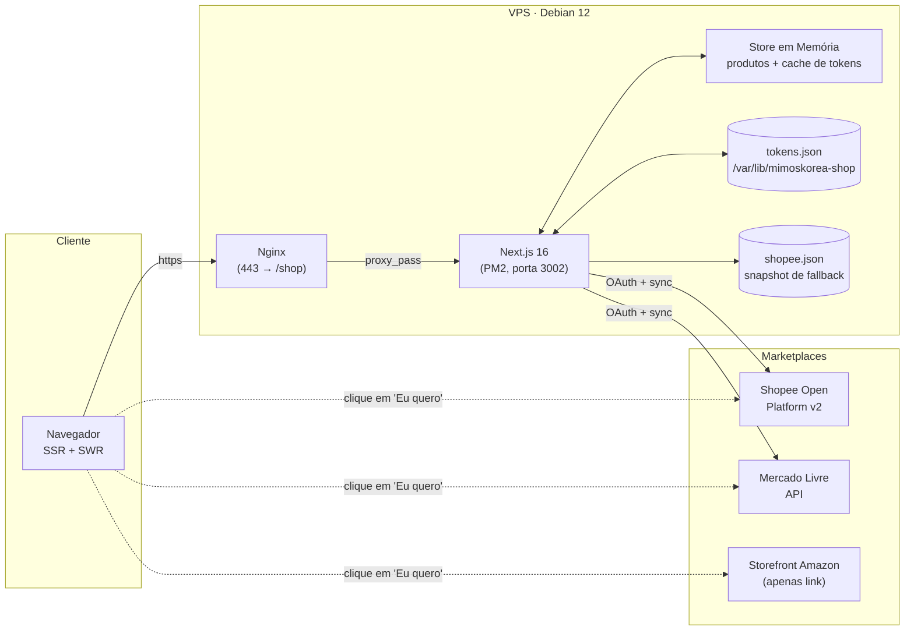
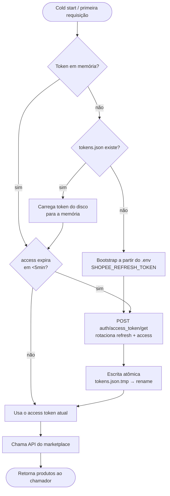
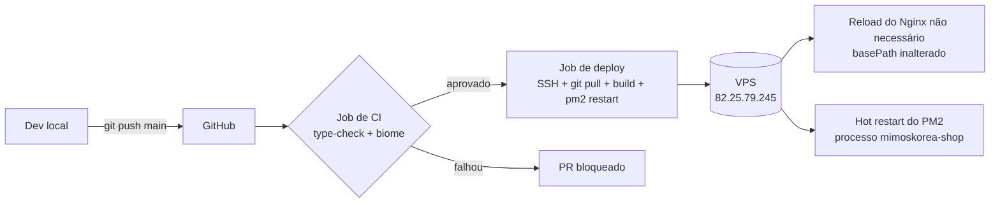

# Mimos Korea Shop


[](https://www.star-history.com/#davccavalcante/mimoskorea-shop&type=timeline&legend=top-left)

Catálogo oficial unificado dos produtos da **Mimos Korea Design** vendidos na **Shopee**, **Amazon Brasil** e **Mercado Livre**. Vitrine somente leitura: cada produto leva direto ao marketplace de origem — sem checkout, sem carrinho, sem dados de cliente neste site.

⭐ Se este projeto te ajudou, dê uma estrela no repositório em [github.com/davccavalcante/mimoskorea-shop](https://github.com/davccavalcante/mimoskorea-shop).

## Stack Técnica

- **Next.js 16** (App Router, Turbopack, React Server Components)
- **TypeScript** em modo strict
- **Tailwind CSS v4** com tokens semânticos de design
- **Figtree** (Google Fonts)
- **Biome** (lint + formatação)
- **Framer Motion** (animações sutis, respeitando `prefers-reduced-motion`)
- **SWR** (scroll infinito no cliente)
- **Sem banco de dados** — tokens OAuth persistidos em arquivo no disco

## Arquitetura



**Princípios-chave:**

- **Catálogo somente leitura.** O app nunca escreve nos marketplaces; apenas lê os anúncios de produtos.
- **Sem banco de dados externo.** A fonte da verdade para tokens é um único arquivo JSON em disco; os dados de produto vivem na memória do processo, re-hidratados em cold start a partir de um snapshot commitado + sync ao vivo.
- **Snapshot como rede de segurança.** [`lib/snapshots/shopee.json`](lib/snapshots/shopee.json) é commitado e popula a memória antes de qualquer chamada de API, então o catálogo permanece preenchido mesmo se a Shopee estiver fora do ar ou os tokens forem revogados.
- **Um link de saída por card.** Cada CTA de produto abre o marketplace de origem em uma nova aba; nunca proxiamos nem reproduzimos o anúncio do marketplace.

## Estrutura do Projeto

```
mimoskorea-shop/
├── app/                              Next.js App Router
│   ├── api/
│   │   ├── products/route.ts         API pública paginada do catálogo
│   │   ├── cron/{sync-shopee,sync-meli}/route.ts
│   │   ├── shopee/oauth/{start,callback}/route.ts
│   │   └── mercadolivre/oauth/{start,callback}/route.ts
│   ├── icon.tsx                      favicon 32x32 (next/og)
│   ├── apple-icon.tsx                180x180 (next/og)
│   ├── opengraph-image.tsx           preview social 1200x630
│   ├── robots.ts · sitemap.ts · llms.txt/route.ts
│   ├── globals.css                   tokens Tailwind v4
│   ├── layout.tsx · page.tsx
├── components/
│   ├── motion-provider.tsx           gate de prefers-reduced-motion
│   ├── product-card.tsx · product-card-skeleton.tsx
│   ├── product-grid.tsx              scroll infinito com SWR
│   ├── platform-badge.tsx            pill Shopee/ML/Amazon
│   ├── price.tsx                     layout R$ separando centavos
│   ├── promo-strip.tsx               faixa superior estilo varejo
│   └── site-footer.tsx
├── lib/
│   ├── brand.ts                      espelho das cores da marca (para next/og)
│   ├── env.ts                        loaders tipados de env
│   ├── products.ts                   tipos Product / Marketplace
│   ├── cache/memory.ts               store em memória do processo (Map)
│   ├── repo/
│   │   ├── products.ts               read API + upsert + archive
│   │   ├── bootstrap.ts              seed do snapshot + gatilhos de sync
│   │   ├── tokens.ts                 fachada memória + disco
│   │   └── tokens-fs.ts              leitura/escrita atômica de JSON
│   ├── snapshots/shopee.json         fallback de produtos commitado
│   ├── shopee/                       cliente Open Platform v2 + sync
│   └── meli/                         cliente Mercado Livre + sync
├── public/logo.svg
├── deploy/nginx.conf                 vhost de produção (proxy /shop → :3002)
└── .github/workflows/deploy.yml      pipeline de CI/CD
```

## Fluxo de Requisição

O que acontece na **primeira** requisição após o servidor iniciar:

```mermaid
sequenceDiagram
    autonumber
    actor U as Usuário
    participant N as Nginx
    participant A as App Next.js
    participant M as Memória
    participant F as tokens.json
    participant S as API Shopee
    participant L as API Mercado Livre

    U->>N: GET https://mimoskorea.com.br/shop/
    N->>A: proxy → localhost:3002
    A->>A: getProductsPage(1)
    A->>A: bootstrapIfEmpty()
    A->>M: seed do snapshot (110 produtos, instantâneo)
    par sync assíncrono por marketplace (janela de 10 min)
        A->>F: lê token da shopee
        F->>A: { access, refresh, expiresAt }
        A->>S: get_item_list + base_info + model_list
        S->>A: itens (paginados, em lotes de 50)
        A->>M: upsertProducts(shopee)
    and
        A->>F: lê token do meli
        F->>A: { access, refresh }
        A->>L: users/{id}/items/search + items?ids
        L->>A: itens (em lotes de 20)
        A->>M: upsertProducts(mercadolivre)
    end
    A->>U: HTML em SSR com os primeiros 18 itens (round-robin por marketplace)
    Note over U: Cliente SWR assume&#59; scroll infinito<br/>busca /api/products?page=N
```



Requisições subsequentes dentro da janela de sync de 10 minutos pulam o sync ao vivo e servem direto da memória.

## Ciclo de Vida do Sync e dos Tokens



**Por que um arquivo e não um banco:** refresh tokens de marketplace rotacionam a cada uso. Se mantivéssemos o valor de seed apenas em `.env`, o segundo cold start falharia, pois o refresh token do env já estaria invalidado. O arquivo em disco é o único lugar que sobrevive a reinícios de processo e à rotação de tokens.

## Deploy

Alvo: **Debian 12 + Nginx + PM2**. CI/CD via GitHub Actions em push na `main`.



Especificidades de produção:

- App escuta em **`:3002`** (processo PM2 chamado `mimoskorea-shop`); o Nginx faz proxy de `https://mimoskorea.com.br/shop/*` → `localhost:3002`
- O build é feito **no servidor** com `NEXT_PUBLIC_BASE_PATH=/shop` para que todas as URLs internas (`/_next/*`, `/api/*`, `/sitemap.xml`) recebam o prefixo correto
- Os tokens ficam em **`/var/lib/mimoskorea-shop/tokens.json`** (fora do diretório de deploy, sobrevive a `git pull`)
- Health check em duas etapas após o restart: `curl localhost:3002/shop/` e depois `curl -H Host: ... localhost/shop/` para validar o roteamento do Nginx sem depender de rede externa

## Contribuindo

Pull requests são bem-vindos. Antes de abrir um:

1. **Setup local**

    ```bash
    git clone https://github.com/davccavalcante/mimoskorea-shop.git
    cd mimoskorea-shop
    npm install
    cp .env.example .env   # se presente; caso contrário peça ao mantenedor a config necessária
    npm run dev
    ```

    O servidor de dev roda em `http://localhost:3002`.

2. **Checagens obrigatórias antes de commitar**

    ```bash
    npm run type-check
    npm run biome
    ```

    O pipeline de CI roda ambas — PRs são bloqueados caso contrário.

3. **Convenções**

    - Branches: `feature/<short-desc>` ou `fix/<short-desc>`
    - Commits: imperativo e curto, idealmente Conventional Commits (ex.: `fix(shopee): handle has_model items`)
    - Um PR por mudança coerente; descrição em inglês ou pt-BR; inclua screenshots para mudanças de UI
    - Sem ícones em emoji (use Phosphor); sem sombras decorativas; tokenize cores novas em `app/globals.css` em vez de hardcodar hex

4. **Reportar bug / pedir feature**: abra uma issue em [github.com/davccavalcante/mimoskorea-shop/issues](https://github.com/davccavalcante/mimoskorea-shop/issues).

## Patrocinadores

Junte-se a nós em nossa jornada enquanto continuamos a inovar e criar soluções pioneiras. Seu apoio é a pedra angular do nosso sucesso!

Apoie-nos com USDT (TRC-20): `TS1vuhMAhFpbd7y68cu5ZtP9PsXVmZWmeh`

Patrocine este projeto no GitHub: [Patrocinar](https://github.com/sponsors/davccavalcante)

## Licença

Este projeto é de código aberto para uso pessoal ou interno. MAIC™, HIM™, NHE™ são proprietários e não podem ser copiados, distribuídos ou utilizados sem permissão explícita de [David Côrtes Cavalcante](https://linkedin.com/in/hellodav). Consulte LICENSE.txt para os termos vinculantes que regem o uso, a cópia e a distribuição.

MAIC™ (Massive Artificial Intelligence Consciousness) é um framework de inteligência sistêmica projetado para coordenar, supervisionar e governar ecossistemas de inteligência artificial em larga escala. Ele provê consciência de contexto global, alinhamento e orquestração entre múltiplos modelos, agentes e camadas de decisão, garantindo coerência, controle de risco e conformidade ao longo de operações complexas de IA.

HIM™ (Hybrid Intelligence Model) é uma camada de inteligência híbrida que integra sistemas de inteligência artificial com lógica, regras, heurísticas e intenção estratégica definidas por humanos. O HIM™ funciona como núcleo cognitivo passivo, responsável por interpretar objetivos, refinar intenção e estruturar processos de tomada de decisão antes e depois da execução do modelo de IA.

NHE™ (Non-Human Entity) refere-se a uma entidade cognitiva não humana com identidade funcional definida e agência operacional dentro de um ecossistema de IA. Uma NHE™ não é classificada como inteligência artificial isoladamente, mas como entidade autônoma ou semiautônoma que opera por meio de camadas coordenadas de inteligência, interagindo com sistemas, usuários e ambientes mantendo identidade não antropomórfica.

## Salvaguardas de Privacidade

MAIC™, HIM™, NHE™ e a plataforma ou sistema deste projeto são desenhados e operados em alinhamento com os princípios de controle de acesso baseado em papéis (RBAC) e com os requisitos da ISO/IEC 42001. O tratamento de dados segue políticas estritas de governança, incluindo acesso controlado aos componentes do sistema, segregação de funções e períodos curtos de retenção para informações sensíveis. Este projeto impõe a política explícita de não usar dados pessoais ou de clientes para treinar ou aperfeiçoar MAIC™, HIM™ ou NHE™. Todos os dados sensíveis processados dentro do ecossistema deste projeto são protegidos por criptografia e hashing criptográfico padrão de mercado, garantindo confidencialidade, integridade e responsabilização ao longo de todo o ciclo de vida da inteligência.
